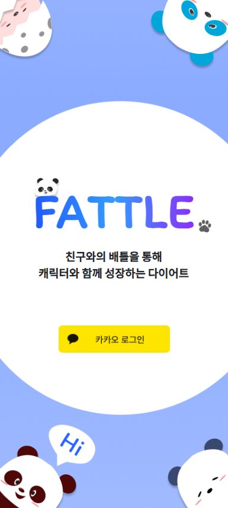
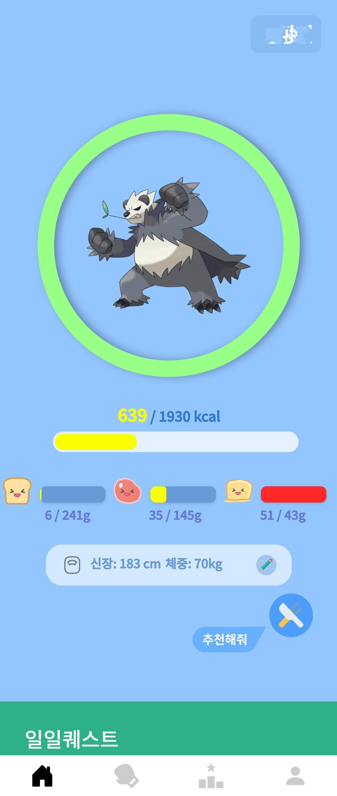
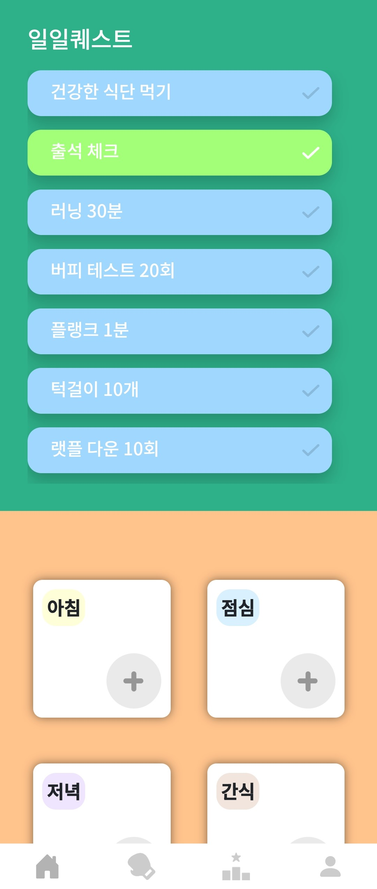
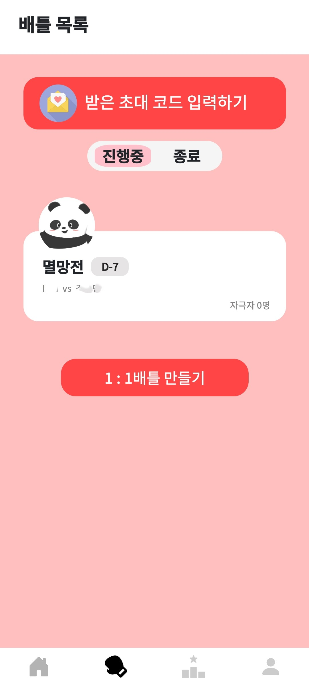
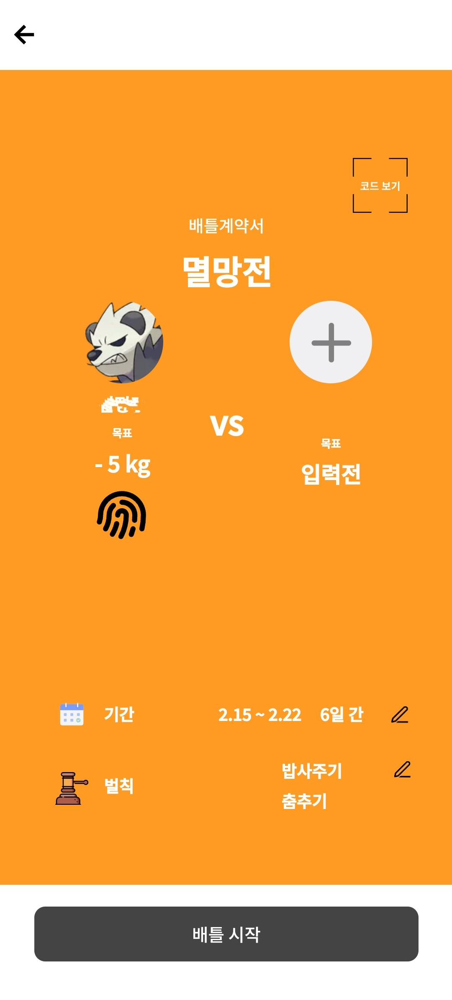
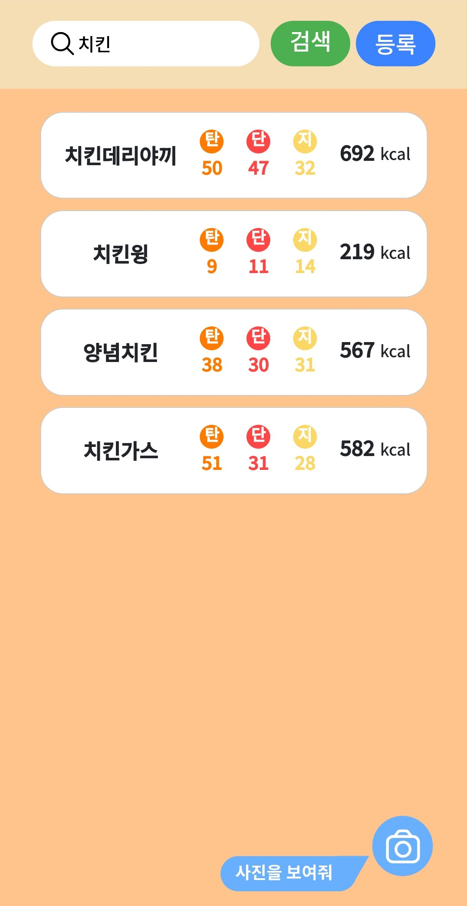
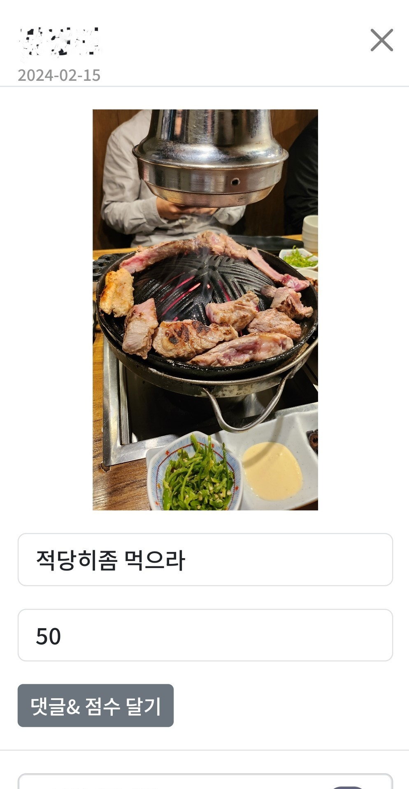
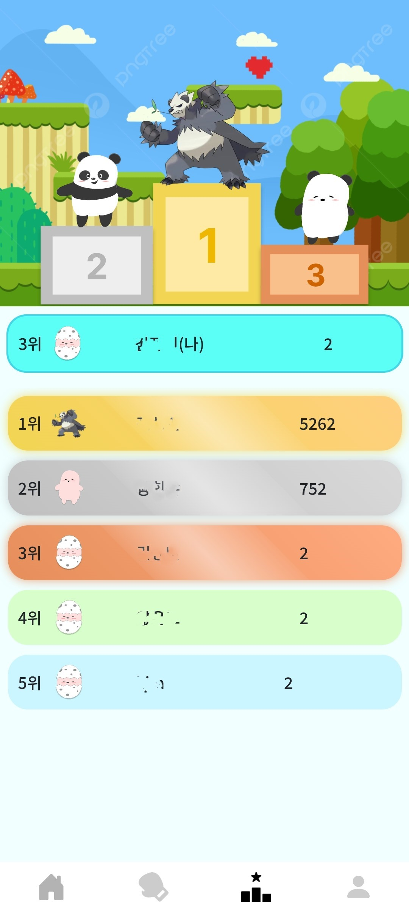
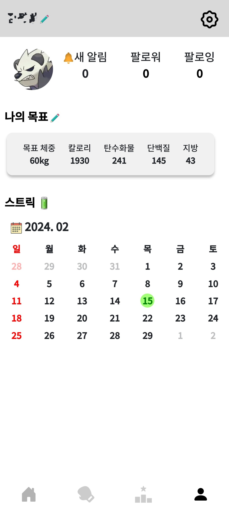

d# FATTLE

<br/>
<div align="center"></div>
<br/>
<div align="center">친구와의 배틀을 통해 캐릭터와 함께 성장하는 다이어트, <b>FATTLE</b></div>
<br/>

## 0️⃣ 프로젝트 목차

[FATTLE](#FATTLE)

- [프로젝트 소개](#프로젝트-소개)
  - [영상](#영상)
  - [진행 기간](#진행-기간)
  - [배경](#배경)
  - [개요](#개요)
  - [주요 기능](#주요-기능)
  - [개발 환경](#개발-환경)
  - [파일 구조](#파일-구조)
  - [협업 툴](#협업-툴)
- [팀원 소개](#팀원-소개)
- [서비스 화면](#서비스-화면)

## 1️⃣ 프로젝트 소개

💎 SSAFY 10기 2학기 공통프로젝트 - FATTLE

### 🎞️ 영상

<center>
[](https://youtu.be/xSRQeGWih9o)
</center>

### 📆 진행 기간

2024.01.08(월) ~ 2024.02.16(금) (39일간 진행)

### 🌄 배경

인생의 목표 다이어트, 매번 실패하는 당신! 다이어트에 성공하지 못하는 이유는 뭘까요?

FATTLE은 다이어트에 동기를 부여해 주는 서비스입니다. 다른 친구들과 다이어트 경쟁을 하면, 질 수 없겠죠? 꾸준히 다이어트를 하면 귀여운 캐릭터가 자라나요! FATTLE을 통해 모두 다이어트에 성공해봐요!

### 📖 개요

FATTLE은 FAT과 BATTLE의 합성어입니다.
FATTLE은 다이어트 현황을 공유하고, 이를 통해 지인들에게 자극을 받으면서 성공적으로 다이어트를 이뤄낼 수 있도록 도와주는 웹서비스입니다. 또한 서비스를 이용할수록 성장하는 귀여운 캐릭터를 통해 다이어트에 대한 동기부여를 더욱 얻을 수 있습니다.

### 🎲 주요 기능

- 캐릭터 성장시키기

  - 서비스를 이용할 수록 캐릭터가 성장합니다.
  - 여러 서비스를 통해 경험치를 얻을 수 있습니다.
  - 내가 얻은 경험치를 다른 유저들과 비교할 수 있습니다.

- 다이어트 배틀

  - 친구와 함께 일대일 다이어트 배틀을 진행합니다.
  - 내기 요소를 걸어서 배틀에 긴장감을 더할 수 있습니다.
  - 라이브 방송, 식단 공유 등을 통해 다이어트 현황을 공유할 수 있습니다.
  - 배틀에 참여하지 않는 친구들도 자극을 줄 수 있습니다.
  - 배틀을 하고 있는 친구들에게 점수를 줄 수 있습니다.

- 일일 퀘스트

  - 매일 수행할 수 있는 퀘스트가 갱신됩니다.
  - 다이어트 식단, 운동 등의 퀘스트가 준비되어 있습니다.
  - 매일 일정 개수 이상의 퀘스트를 수행하면 스트릭이 쌓입니다.

- 식단 등록

  - 오늘 먹은 식단을 등록해서 관리할 수 있습니다.
  - 식단 사진을 올리면 AI 분석을 통해 열량 및 탄단지 성분 함량을 알려줍니다.
  - 오늘 섭취한 열량 및 탄단지를 내 기준 수치와 비교할 수 있습니다.

- 다이어트 식단 추천
  - 나의 오늘 섭취량을 통해 다이어트 식단을 추천받을 수 있습니다.
  - 지금까지 섭취한 열량, 탄단지를 기준으로 식단을 추천합니다.

### 🛠️ 개발 환경

- Front-End

  - Visual Studio Code 1.85.1
  - React 18.2.0
  - Redux 9.1.0
  - Node.js 20.10.0
  - OpenVidu 2.29.1

- Back-End

  - IntelliJ IDEA 2023.3.3 (Community Edition)
  - Java 17 (Azul Zulu version 17.0.9)
  - Spring boot 3.2.2
  - Python 3.8.10
  - PyTorch 1.8.0
  - MySQL 8.0.36

- Server
  - AWS EC2
  - Ubuntu 20.04.6 LTS
  - Nginx 1.18.0
  - OpenSSL 1.1.1f
  - Jenkins 2.443

### 📁 파일 구조

- Front-End
  ```
  FE
  ├── public
  │   ├── images
  │   │   └── profiles
  │   └── src
  │       └── assets
  │           └── svg
  │               └── avatar
  └── src
      ├── assets
      │   ├── fonts
      │   ├── images
      │   │   ├── battle
      │   │   ├── footer
      │   │   ├── join
      │   │   ├── main
      │   │   └── ranking
      │   ├── login
      │   └── svg
      │       ├── avatar
      │       ├── battle
      │       ├── commons
      │       ├── Food
      │       └── mypage
      ├── commons
      ├── components
      │   ├── battle
      │   ├── commons
      │   ├── login
      │   ├── main
      │   └── mypage
      ├── pages
      │   ├── battle
      │   ├── join
      │   ├── login
      │   ├── main
      │   ├── mypage
      │   └── ranking
      ├── services
      │   ├── auth
      │   ├── battle
      │   ├── join
      │   ├── login
      │   ├── main
      │   └── mypage
      ├── store
      ├── styles
      │   ├── battle
      │   ├── commons
      │   ├── join
      │   ├── login
      │   ├── main
      │   ├── mypage
      │   └── ranking
      └── utils
          ├── battle
          ├── commons
          └── mypage
  ```
- Back-End
  ```
  fattle
    ├── api
    │   ├── controller
    │   └── service
    ├── config
    ├── dto
    │   ├── dto
    │   ├── request
    │   └── response
    ├── entity
    ├── exceptions
    ├── filter
    ├── repository
    └── utils
  ```

### 💬 협업 툴

- Git
- Gerrit
- JIRA
- Mattermost
- Notion
- Discord

## 2️⃣ 팀원 소개

| 이름                                          | 직책           | 역할       | 담당                                                 |
| --------------------------------------------- | -------------- | ---------- | ---------------------------------------------------- |
| [강주원](https://github.com/kjw0821)          | 팀장           | 백엔드     | DB 설계, API 설계, Git 관리, 최종 발표               |
| [김정민](https://github.com/Jm0nn)            | 백엔드리더     | 백엔드     | DB 설계, API 설계, API 키 관리, EC2 서버 관리, CI/CD |
| [박찬영](https://github.com/Park-chan-00)     | 팀원           | 백엔드     | DB 설계, API 설계, AI 모델 적용, 중간 발표           |
| [양윤모](https://github.com/momo-abcd)        | 프론트엔드리더 | 프론트엔드 | UI/UX 설계, OpenVidu 서버 관리, Git 관리             |
| [정창휘](https://github.com/JungChnagHwi/TIL) | 팀원           | 프론트엔드 | UI/UX 설계, 디자인, UCC 제작                         |
| [진성민](https://github.com/sengmin14)        | 팀원           | 프론트엔드 | UI/UX 설계, 디자인, 협업 툴 관리                     |

## 3️⃣ 서비스 화면

### 🏠 첫 화면

- 화면 중앙의 카카오 로그인 버튼을 통해 로그인 또는 회원가입을 진행합니다.
- 로그인을 한 사용자만 서비스를 이용할 수 있습니다.

<div align="center"></div>

### 🌈 메인

- 첫 화면에 자신의 캐릭터와 경험치, 오늘 섭취한 열량 및 영양성분이 표시됩니다.
- 현재 내 신장 및 체중을 수정할 수 있습니다.
- 내 데이터를 기반으로 다이어트 식단을 추천받을 수 있습니다.
- 운동 및 식단 등록을 통해 일일퀘스트를 수행할 수 있고, 캐릭터 성장을 위한 경험치를 쌓을 수 있습니다.

<div align="center"> </div>

### 🥊 배틀

- 배틀 탭을 눌러 배틀 목록 페이지로 이동할 수 있습니다.
- 배틀 만들기 또는 받은 초대 코드 입력하기를 통해 배틀 생성 화면으로 이동할 수 있습니다.
- 배틀 정보를 입력하고 배틀 시작 버튼을 눌러 배틀을 시작할 수 있습니다.
- 배틀 진행 화면에서는 지금까지 얻은 점수, 섭취한 열량 등을 비교할 수 있습니다.
- 배틀에 참여하지 않는 사람들도 초대코드를 통해 배틀을 확인할 수 있습니다.

<div align="center"> </div>

### 📢 라이브 방송

- 배틀 진행중에는 라이브 방송을 할 수 있습니다.
- 나의 운동 현황을 다른 사람과 공유할 수 있습니다.
- 시청자들은 자신의 정체를 숨긴 채로 방송중인 사람에게 자극을 줄 수 있습니다.
- 변조된 음성으로 말을 하거나 익명 채팅으로 자극을 줄 수 있습니다.
- 방송중인 사람에게 포인트를 부여할 수 있습니다.

<div align="center"></div>

### 🥗 식단

- 나의 식단을 업로드할 수 있습니다.
- 사진 촬영을 통해 식단을 업로드 할 수 있습니다.
- 사진을 업로드하면 AI 분석을 통해 식단의 열량 및 영양성분을 알려줍니다.
- 사진이 없다면 메뉴 검색을 통해 업로드할 수 있습니다.
- 배틀 중에는 다른 사람들이 나의 식단에 평가를 줄 수 있습니다.

<div align="center"> </div>

### 🏅 랭킹

- 랭킹 탭을 눌러 랭킹 페이지로 이동할 수 있습니다.
- 나의 캐릭터 및 경험치를 다른 사람들과 비교할 수 있습니다.

<div align="center"></div>

### 😀 마이 페이지

- 마이 페이지 탭을 눌러 마이 페이지로 이동할 수 있습니다.
- 마이 페이지에서 닉네임, 소개말, 목표 등을 수정할 수 있습니다.
- 일일퀘스트를 완료한 날에는 달력에 스트릭이 쌓입니다.

<div align="center"></div>
