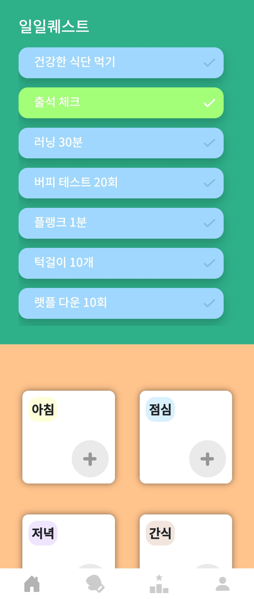
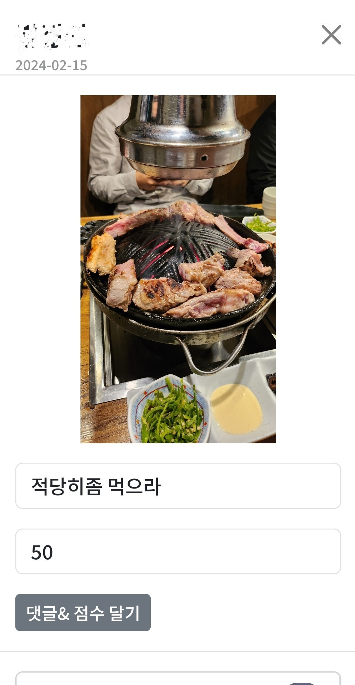
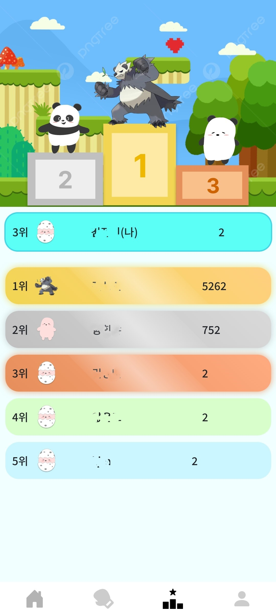

# FATTLE 포팅 매뉴얼

## 목차

1. [환경 설정](#1-환경설정)
   - [기술 스택](#기술-스택)
   - [외부 서비스](#외부-서비스)
2. [빌드 및 배포](#2-빌드-및-배포)
   - [환경 변수 설정](#환경-변수-설정)
   - [빌드](#빌드)
   - [배포](#배포)
3. [시연 시나리오](#3-시연-시나리오)

## 1. 환경 설정

### 기술 스택

- 이슈 관리: Jira
- 형상 관리: Gitlab
- 빌드/배포 관리: Jenkins
- 커뮤니케이션: Mattermost, Notion, Discord
- 디자인: Figma
- 개발 환경
  - IDE
    - Visual Studio Code 1.85.1
    - IntelliJ IDEA 2023.3.3 (Community Edition)
  - 서버: AWS EC2
    - Ubuntu 20.04.6 LTS
    - Nginx 1.18.0
    - OpenSSL 1.1.1f
  - Front-End
    - React 18.2.0
    - Redux 9.1.0
    - Node.js 20.10.0
    - OpenVidu 2.29.1
  - Back-End
    - Java 17 (Azul Zulu version 17.0.9)
    - Spring boot 3.2.2
    - Python 3.8.10
    - PyTorch 1.8.0
    - MySQL 8.0.36

### 외부 서비스

- Kakao OAuth: application.yml 참조
- ChatGPT API: .env 참조

## 2. 빌드 및 배포

### 환경 변수 설정

- FE/.env

  - ChatGPT
    ```env
    REACT_APP_GPT_API_KEY={ChatGpt API key}
    ```

- FE/src/config.js

  - API 통신 주소
    ```js
    const BASE_URL = "{URL}/api";
    ```

- BE/src/main/resources/application.yml

  - MySQL
    ```yml
    datasource:
      url: MySQL DB 주소
      username: MySQL 유저 이름
      password: MySQL 유저 비밀번호
    ```
  - OpenVidu
    ```yml
    openvidu:
      public-ip: OpenVidu IP 주소
      secret: OpenVidu secret key
    ```
  - Flask
    ```yml
    flask:
      connection-uri: Flask 주소
    ```

- BE/src/main/resources/application-oauth.yml
  - Kakao OAuth
    ```yml
    spring:
      security:
        oauth2:
          client:
            registration:
              kakao:
                client-id: Kakao API key
                redirect-uri: 카카오 로그인 후 Redirect할 주소 ({URL}/login-callback)
                client-secret: Kakao API secret
    ```
  - JWT
    ```yml
    jwt:
      token:
        secret-key: JWT secret key
    ```

### 빌드

- Front

  ```bash
  npm install
  npm run build
  ```

- Back-Spring

  ```bash
  chmod +x gradlew
  ./gradlew clean build -x test
  ```

- Back-Flask
  ```bash
  pip install -r requirements.txt
  python app.py
  ```

### 배포

- /etc/nginx/sites-available/default

  ```
  server {
    listen 80;
    server_name i10e106.p.ssafy.io;
    client_max_body_size 100M;
    return 301 https://$host$request_uri;
  }

  server {
    listen 443 ssl;

    server_name i10e106.p.ssafy.io;
    client_max_body_size 100M;

    ssl_certificate /etc/letsencrypt/live/i10e106.p.ssafy.io/fullchain.pem;
    ssl_certificate_key /etc/letsencrypt/live/i10e106.p.ssafy.io/privkey.pem;

    access_log   /var/log/nginx/access.log;
    error_log    /var/log/nginx/error.log;

    location /api {
      proxy_pass http://localhost:8000;
    }

    location /food_detect {
      proxy_pass http://localhost:5000;
    }

    location /{
      proxy_pass http://localhost:3000;
      proxy_set_header Host $host;
      proxy_set_header X-Real-IP $remote_addr;
      proxy_set_header X-Forwarded-For $proxy_add_x_forwarded_for;
      proxy_set_header X-Forwarded-Proto $scheme;
    }
  }
  ```

이후 `sudo service nginx start`

## 3. 시연 시나리오

### 첫 화면

- 화면 중앙의 카카오 로그인 버튼을 통해 로그인 또는 회원가입을 진행합니다.
- 로그인을 한 사용자만 서비스를 이용할 수 있습니다.

<div align="center"></div>

### 메인

- 첫 화면에 자신의 캐릭터와 경험치, 오늘 섭취한 열량 및 영양성분이 표시됩니다.
- 현재 내 신장 및 체중을 수정할 수 있습니다.
- 내 데이터를 기반으로 다이어트 식단을 추천받을 수 있습니다.
- 운동 및 식단 등록을 통해 일일퀘스트를 수행할 수 있고, 캐릭터 성장을 위한 경험치를 쌓을 수 있습니다.

<div align="center"> </div>

### 배틀

- 배틀 탭을 눌러 배틀 목록 페이지로 이동할 수 있습니다.
- 배틀 만들기 또는 받은 초대 코드 입력하기를 통해 배틀 생성 화면으로 이동할 수 있습니다.
- 배틀 정보를 입력하고 배틀 시작 버튼을 눌러 배틀을 시작할 수 있습니다.
- 배틀 진행 화면에서는 지금까지 얻은 점수, 섭취한 열량 등을 비교할 수 있습니다.
- 배틀에 참여하지 않는 사람들도 초대코드를 통해 배틀을 확인할 수 있습니다.

<div align="center"> </div>

### 라이브 방송

- 배틀 진행중에는 라이브 방송을 할 수 있습니다.
- 나의 운동 현황을 다른 사람과 공유할 수 있습니다.
- 시청자들은 자신의 정체를 숨긴 채로 방송중인 사람에게 자극을 줄 수 있습니다.
- 변조된 음성으로 말을 하거나 익명 채팅으로 자극을 줄 수 있습니다.
- 방송중인 사람에게 포인트를 부여할 수 있습니다.

<div align="center"></div>

### 식단

- 나의 식단을 업로드할 수 있습니다.
- 사진 촬영을 통해 식단을 업로드 할 수 있습니다.
- 사진을 업로드하면 AI 분석을 통해 식단의 열량 및 영양성분을 알려줍니다.
- 사진이 없다면 메뉴 검색을 통해 업로드할 수 있습니다.
- 배틀 중에는 다른 사람들이 나의 식단에 평가를 줄 수 있습니다.

<div align="center"> </div>

### 랭킹

- 랭킹 탭을 눌러 랭킹 페이지로 이동할 수 있습니다.
- 나의 캐릭터 및 경험치를 다른 사람들과 비교할 수 있습니다.

<div align="center"></div>

### 마이 페이지

- 마이 페이지 탭을 눌러 마이 페이지로 이동할 수 있습니다.
- 마이 페이지에서 닉네임, 소개말, 목표 등을 수정할 수 있습니다.
- 일일퀘스트를 완료한 날에는 달력에 스트릭이 쌓입니다.

<div align="center"></div>
